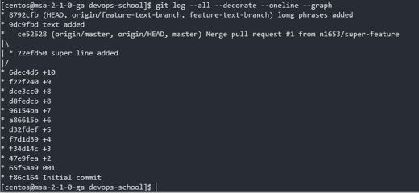
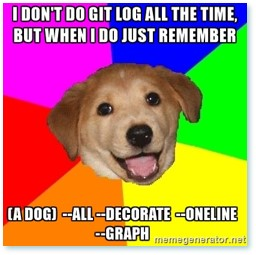

# Git – essentials (extended)

### Git - log 
```sh
$ git log --all --decorate --oneline --graph
```



### Git - cherry-pick

The git cherry-pick command is used to take the change introduced in a single Git commit and try to re-introduce it as a new commit on the branch you’re currently on. This can be useful to only take one or two commits from a branch individually rather than merging in the branch which takes all the changes.


```sh
$ git branch
  feature-text-branch
* master
$ git log --all --decorate --oneline --graph
* 7e365d0 (origin/feature-text-branch) sentences feature added
* 8792cfb (feature-text-branch) long phrases added
* 9dc9fbd text added
*   ce52528 (HEAD, origin/master, origin/HEAD, master) Merge pull request #1 from n1653/super-feature
|\
| * 22efd50 super line added
|/
* 6dec4d5 +10
* f22f240 +9
* dce3cc0 +8
* d8fedcb +8
* 96154ba +7
* a86615b +6
* d32fdef +5
* f7d1d39 +4
* f34d14c +3
* 47e9fea +2
* 65f5aa9 001
* f86c164 Initial commit
```

```sh
$ git checkout feature-text-branch
Switched to branch 'feature-text-branch'
$ git log --all --decorate --oneline --graph
* 7e365d0 (origin/feature-text-branch) sentences feature added
* 8792cfb (HEAD, feature-text-branch) long phrases added
* 9dc9fbd text added
*   ce52528 (origin/master, origin/HEAD, master) Merge pull request #1 from n1653/super-feature
|\
| * 22efd50 super line added
|/
* 6dec4d5 +10
* f22f240 +9
* dce3cc0 +8
* d8fedcb +8
* 96154ba +7
* a86615b +6
* d32fdef +5
* f7d1d39 +4
* f34d14c +3
* 47e9fea +2
* 65f5aa9 001
* f86c164 Initial commit
```

